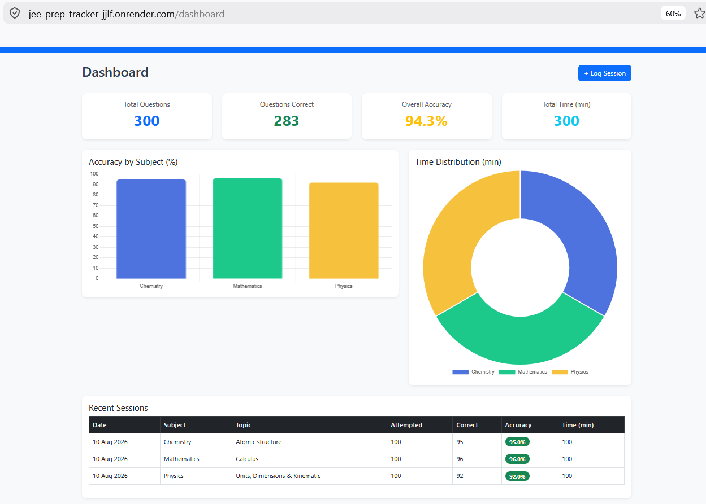

# JEE Prep Tracker

🚀 Live at: https://jee-prep-tracker-jjlf.onrender.com

I built this web app to track my JEE preparation. I was logging sessions in a notebook and it was getting hard to see patterns: which subjects I was weak in, which topics kept coming up in mistakes, how much time I was actually spending. So I decided to build something to do that automatically.

What it does
Log a practice session: subject, topic, how many questions I attempted and got right, time spent
Log a mistake: what the question was, whether it was a conceptual mistake, calculation error, or silly mistake
Dashboard with charts showing accuracy by subject and time distribution
Automatically shows weak topics (anything below 60% accuracy)
Mistake review page with colour coded badges
Tech stack

Python, Flask, SQLite, SQLAlchemy, Bootstrap 5, Chart.js. Deployed on Render.

Background

I'm in Class 12 at Narayana Olympiad School in Bengaluru, preparing for both JEE and CBSE boards. JEE prep on top of school is roughly 20-25 extra hours a week. I wanted to use what I was learning in CS to actually help with that preparation, so I built this over about 10 weeks as a self-directed project.

This is my second CS project, after a phishing URL detector. Both came out of noticing how much people trust systems they can't actually see inside.